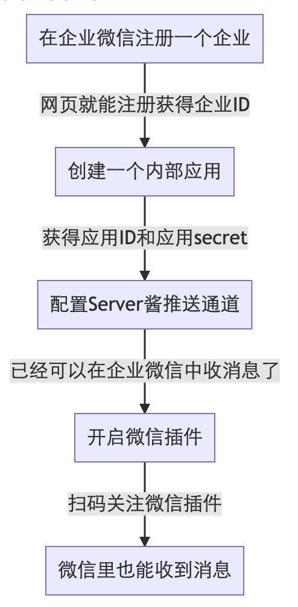

# lotus-alert

本脚本用于FileCoin日常巡检，及时将告警信息通知到企业微信。该脚本主要对常见掉算力原因及部分需要日常巡检的业务进行监控，使用Server酱进行消息推送。脚本部署在Lotus、Miner（多miner），为了更加轻量级和简单易用，对于worker机器并未进行详细的监控。脚本中的告警业务是作者根据主网上线以来挖矿的实际经验总结得出，基本可以涵盖90%以上掉算力的情况。（该脚本作者自用，可能有考虑不周的情况，欢迎大家及时沟通，一起完善脚本）。

## 1. 告警功能详述

- 高度同步异常通知  
巡检Lotus区块链高度同步是否能够及时完成，避免节点出现与主网高度不一致的情况。
- 显卡掉驱动通知  
爆块及WindowPost都需要使用显卡进行计算，避免出现掉显卡驱动的情况。
- Miner进程检查  
巡检Miner进程是否存在，若系统中Miner进程不存在就会进行告警。
- lotus进程检查  
巡检Lotus进程是否存在，若系统中Lotus进程不存在就会进行告警。
- 消息堵塞通知  
若发生消息堵塞，进行告警通知。
- 存储文件挂载检查  
对Miner机器中存储文件的挂载进行检查，若无存储挂载时进行告警。
- WindowPost报错通知  
对WindowPost-Miner进行日志进行检索，当出现`window post failed`时进行告警。
- 爆块通知  
当节点爆块时，通知到微信。
- 任务超时通知  
当Seal-Miner中执行的任务超过X小时进行通知。
- 钱包余额预警  
可设置Default钱包余额告警值，当Default钱包余额低于某个值时进行告警通知。
- 服务器宕机/网络故障告警  
可对服务器宕机或者网络发生故障时进行告警。
- 阵列卡常见故障告警
可对存储服务器使用阵列卡进行监控，对于常见故障如硬盘故障\丢失、磁盘坏道、预警盘进行监控告警，及时发现更换硬盘。
- 每日简报
每天对集群告警脚本进行自检，检验所有机器脚本是否在正常运行。同时开启「每日简报」功能将不再实时发送爆块、扇区出错，改为每日总结发送一次。
- ssh登录IP地址是否授权检查
可自定义ssh_white_ip_list，如果不在列表中的IP登录了本服务器，将发出报警消息

## 2. 使用方法及参数设置

### 2.1 阵列卡告警使用

使用阵列卡告警前需要安装`MegaCli64`(支持LSI阵列卡，其他阵列卡暂无测试)，安装命令如下：

```shell
wget http://mirror.cogentco.com/pub/misc/MegaCli-8.07.14-1.noarch.rpm
sudo apt-get  update
sudo apt-get install alien
sudo alien -i MegaCli-8.07.14-1.noarch.rpm
sudo ln -s /opt/MegaRAID/MegaCli/MegaCli64 /usr/bin/MegaCli64
```

### 2.2 每日简报使用

正常启用每日简报需要正确填写每台机器告警日志路径，确保每台告警脚本运行机器时间校准正确,同时Wining-Miner机器需要ssh免密登录到其他告警机器。

### 2.3 Server酱使用

- SendKey  
登陆使用Server酱获取`SendKey`，详细内容可以参考[Server酱文档](https://sct.ftqq.com/forward)。
大致步骤为：  

- openid  
该参数用于配置Server酱推送到企业微信中的特定人或多个人，内容为接收人在企业微信中的 UID，填写多个人使用`|`隔开，不填则发送给通道配置页面的接收人。
企业微信中某个成员的UID可以在该企业中的账号，直接在通讯录中查看成员即可获取该成员的「账号」（即该成员UID）

### 2.4 脚本其他参数配置

- check_machine  
告警机器类型，该参数用于标识脚本运行所在的机器类型：填写`一`为`Lotus`，`二`为`Seal-Miner`，`三`为`Wining-Miner`，`四`为`WindowPost-Miner`。当同一个台机器上运行多个功能或使用官方Miner并未进行拆分时，该参数可写入多个类型。比如当使用官方Miner时，可以设置`check_machine = "二三四"`来对该机器的封装、爆块和WindowPost进行告警。
- file_mount  
存储挂载路径，该参数用于填写存储挂载路径，在Seal-Miner、Wining-Miner、WindowPost-Miner上运行时需要填写，多个挂载目录使用'|'进行分隔。
- wdpost_log_path  
Wdpost日志路径，该参数用于填写WindowPost-Miner日志路径，在WindowPost-Miner上运行时需要填写。
- winingpost_log_path  
Wining日志路径，该参数用于填写WiningPost-Miner日志路径，在Wining-Miner上运行时需要填写。
- fil_account  
节点号信息，该参数填写后在告警信息标题中会展示节点号，用于多个告警节点号的区分，若只有一个节点号需要进行告警则可不填。
- job_time_alert  
最长时间任务告警，如设置10，那么Seal-Mienr执行`lotus-miner sealing jobs`中最长的时间超过10小时就会告警。
- default_wallet_balance  
Default钱包余额告警阈值，如设置50，那么当Default钱包余额低于50时就会告警。
- check_interval
程序检测间隔时间，默认300秒，可根据需要自行修改，建议不要小于180秒

## 3. 脚本使用及运行

该脚本使用python编写，在修改参数后在对应的机器上使用`python3 lotus_alert.py`运行即可，后台运行脚本使用命令：
`nohup python3 lotus_alert.py > alert.log 2>&1 &`  
执行成功后可以通过日志内容查看脚本运行情况，当出现`已巡检完毕，无异常 sleep 300 seconds`表示脚本已经正常运行。
